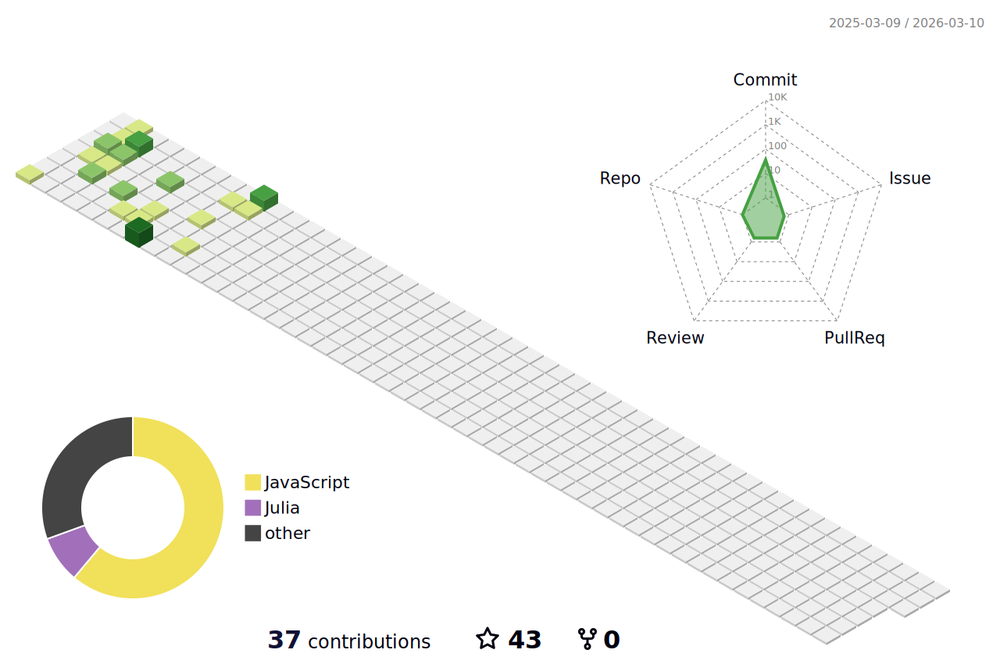

<h1> Hi there  I am Erhan ERTEM </h1>

### About Me

 I’m currently learning ...Javascript

 I'm planning to heat up with more stuff on MySQL, MongoDB, PostgreSQL, Typscript, Vue, React

 Alternate languages that I would like to look into in the future are Python, Julia, Flutter and C++ if I can keep my sanity.

 How to reach me  

&nbsp;

### Languages and Tools 

More Skills

......

Courses, Bootcamps attended

| **Course/Bootcamp**                                                                   | **Cert/Hrs**                                                                                                                                                                                                                         | **Languages/Frameworks**                                                                                                                                                                                                                                                                                                                                                                                                                                                                                                                                                                                                                                                                                                                                                                                                                                                                                                                                                           |
| ------------------------------------------------------------------------------------------------ | ----------------------------------------------------------------------------------------------------------------------------------------------------------------------------------------------------------------------------------------------- | --------------------------------------------------------------------------------------------------------------------------------------------------------------------------------------------------------------------------------------------------------------------------------------------------------------------------------------------------------------------------------------------------------------------------------------------------------------------------------------------------------------------------------------------------------------------------------------------------------------------------------------------------------------------------------------------------------------------------------------------------------------------------------------------------------------------------------------------------------------------------------------------------------------------------------------------------------------------------------------------- |
| Udemy The Git & Github Bootcamp - Colt Steele                                         | &nbsp;17hrs                                                                                                                  |                                                                                                                                                                                                                                                                                                                                                                                                                                                                                                                                                                                                                                                                                      |
| Udemy Build Responsive Real-World Websites with HTML and CSS - Jonas Schmedtmann      | &nbsp;37.5hrs                                                                                                                |                                                                                                                                                                                                                                                                                                                                                                                                                                                                                                                                                                                                                                                                                                         |
| Udemy The Complete Sass & SCSS Course From Beginner to Advanced - Joe Parys et al.    | &nbsp;4hrs                                                                                                                   |                                                                                                                                                                                                                                                                                                                                                                                                                                                                                                                                                                                                                                                                                                                    |
| Udemy SASS - The Complete SASS Course (CSS Preprocessor) - Code and Create et al.     | &nbsp;6hrs                                                                                                                   |                                                                                                                                                                                                                                                                                                                                                                                                                                                                                                                                                                                                                                                                                                                    |
| Udemy Advanced CSS and Sass Flexbox, Grid, Animations and More! - Jonas Schmedtmann   | &nbsp;28hrs                                                                                                                  |                                                                                                                                                                                                                                                                                                                                                                                                                                                                                                                                                                                                                                                                                                                    |
| Udemy Node.js, Express, MongoDB & More The Complete Bootcamp 2023 - Jonas Schmedtmann | &nbsp;42hrs                                                                                                                  |                                                                                                                                                                                                                                                                                                                                                                                                  |
| Udemy The Complete JavaScript Course 2022 From Zero to Expert! - Jonas Schmedtmann    | &nbsp;69hrs                                                                                                                  |                                                                                                                                                                                                                                                                                                                                                                                                                                                                                                                                                                                                                                                                                                                                                                                                                                                                                            |
| Udemy Crash Course Build a Full-Stack Web App in a Weekend! - Jonas Schmedtmann       | &nbsp;12.5hrs                                                                                                                |                                                                                                                                                                                                                                                                                                                                                                                                                                                                                                                |
| Udemy The Ultimate MySQL Bootcamp Go from SQL Beginner to Expert v1/v2 - Colt Steele  |  &nbsp;37.5hrs |                                                                                                                                                                                                                                                                                                                                                                                                                                                                                                        |
| Udemy SQL and PostgreSQL: The Complete Developer's Guide - Stephen Grider             | &nbsp;22hrs                                                                                                                  |                                                                                                                                                                                                                                                                                                                                                                                                                                                                                                                                                                                                                                                                                                                                                                                                                                                                                     |
| Udemy Mastering Regular Expressions in JavaScript - Steven Hancock                    | &nbsp;5.5hrs                                                                                                                 |                                                                                                                                                                                                                                                                                                                                                                                                                                                                                                                                                                                                                                                                                                                                                                                                                                                                                            |
| Udemy Advanced SQL Bootcamp - Jose Portilla                                           | &nbsp;10.5hrs                                                                                                                |                                                                                                                                                                                                                                                                                                                                                                                                                                                                                                                                                                                                                                                                                                                                                                                                                                                                                     |
| Udemy Learn SQL +Security(pen) testing from Scratch - Rahul Shetty                    | &nbsp;13.5hrs                                                                                                                |                                                                                                                                                                                                                                                                                                                                                                                                                                                                                                                                                                                                                                                                                                                                                                                                                                                                                                    |
| Udemy SQL–MySQL Complete Master Bootcamp Beginner to Expert 2023 - Donatus Obomighie  | &nbsp;20.5hrs                                                                                                                |                                                                                                                                                                                                                                                                                                                                                                                                                                                                                                                                                                                                                                                                                                  |
| Udemy MongoDB - The Complete Developer's Guide 2023 - Maximilian Schwarzmüller        | &nbsp;17.5hrs                                                                                                                |                                                                                                                                                                                                                                                                                                                                                                                                                                                                                                                                                                                                                                                                                                                                                                                                                                                                                              |
| Udemy Mastering TypeScript 2023 Edition - Colt Steele                                 | &nbsp;10.5hrs                                                                                                                |                                                                                                                                                                                                                                                                                                                                                                                                                                                                                                                                                                                                                                                                                         |
| Udemy Modern React with Redux 2023 - Stephen Grider                                   | &nbsp;37.5hrs                                                                                                                |                                                                                                                                                                                                                                                                                                                                                                                                                                                                                                                                                                                                         |
| Udemy Tailwind CSS From Scratch Learn By Building Projects - Brad Traversy            | &nbsp;12.5hrs                                                                                                                |                                                                                                                                                                                                                                                                                                                                                                                                                                                                                                                                                                                                                                                                                                                                                                                       |
| Udemy The Complete Java Development Bootcamp - Rayan Slim                             | &nbsp;32hrs                                                                                                                  |                                                                                                                                                                                                                                                                                                                                                                                                                                                                                                                                                                                                                                                                                                                                                                                                                                                                                                    |
| Udemy One Week Python - Colt Steele                                                   | &nbsp;14.5hrs                                                                                                                |                                                                                                                                                                                                                                                                                                                                                                                                                                                                                                                                                                                                                                                                                                                                                                                                                                                                                                  |
| Udemy Webpack 5 and Vite - OnlyKiosk Tech                                             | &nbsp;4.5hrs                                                                                                                 |                                                                                                                                                                                                                                                                                                                                                                                                                                                                                                                                                                                                                                                                                                                                                                                                     |
| Udemy JavaScript Pro: Mastering Advanced Concepts and Techniques - Colt Steele        | &nbsp;19hrs                                                                                                                  |                                                                                                                                                                                                                                                                                                                                                                                                                                                                                                                                                                                                                                                                                                                                                                                                                                                                                            |
| Udemy Complete NodeJS Developer (GraphQL, MongoDB, + more) - Andrei Neagoie           | &nbsp;46.5hrs                                                                                                                               |                                                                                                                                                                                                                                                                                                                                                                                                                                                                                                                                                                                                                                                                                                                                                                                                                                                                                                   |
| Udemy Docker Bootcamp: Conquer Docker with Real-World Projects - Rayan Slim           | &nbsp;5hrs                                                                                                                               |                                                                 |
| Udemy HTMX The Practical Guide - Maximilian Schwarzmüller           | &nbsp;4hrs                                                                                                                               |                                                                 |
| Udemy Understanding TypeScript - Maximilian Schwarzmüller                             | &nbsp;15hrs                                                                                                                                       |                                                                                                                                                                                                                                                                                                                                                                                                                                                                                                                                                                                       |
| Udemy Typescript The Complete Developer's Guide - Stephen Grider                      | &nbsp;27.5hrs                                                                                                                               |                                                                                                                                                                                                                                                                                                                                                                                                                                                                                       |
| Udemy Learn C++ for Game Development - Stephen Ulibarri                      | &nbsp;12.5hrs                                                                                                                               |                                                                                                                                                                                                                                                                                                                                                                                                                                                                            |
| Udemy React & TypeScript The Practical Guide - Maximilian Schwarzmüller                      |  &nbsp;7.5hrs                                                                                                                               |                                                                                                                                                                                                                                                                                                                                                                                                                                                                                 |
| Udemy The Ultimate React Course 2024: React, Redux & More - Jonas Schmedtmann         |  &nbsp;84hrs                                                                                                                                 |          |
| Udemy Ultimate C# Masterclass for 2023 - Krystyna Ślusarczyk                          |  40hrs                                                                                                                                       |                                                                                                                                                                                                                                                                                                                                                                                                                                                                                                                                                                                                                                                                                                                                                                                                       |
| Three.JS Journey - Bruno Simon                                                        |  &nbsp;70.2hrs                                                                                                                               |                                                                                                                                                                                                                                                                                                                                                                                                                                                                                      |
| Udemy Beginning C++ Programming - From Beginner to Beyond - Tim Buchalka              |  &nbsp;46hrs                                                                                                                                 |                                                                                                                                                                                                                                                                                                                                                                                                                                                                                                                                                                                                                                                                                                                                                                                                                                                                                                  |
| Udemy JavaScript Algorithms and Data Structures Masterclass - Colt Steele             |  &nbsp;22hrs                                                                                                                                 |                                                                                                                                                                                                                                                                                                                                                                                                                                                                                                                                                                                                                                                                                                                                                                                                                                                                                            |

