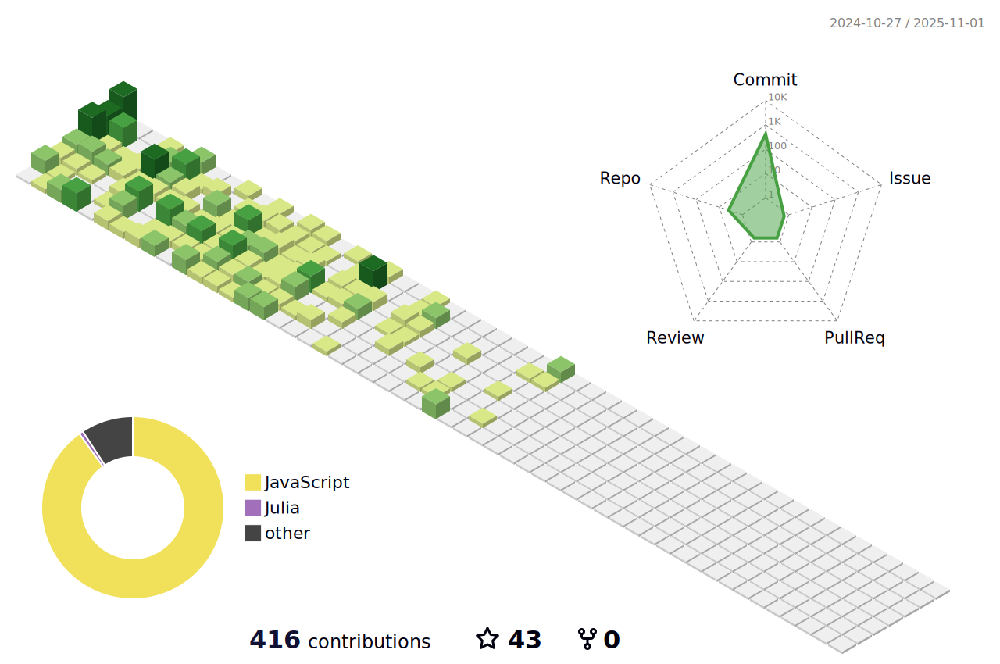
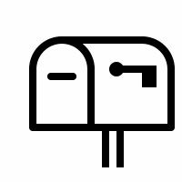

<h1> Hi there  I am Erhan ERTEM </h1> 

### About Me 

  I’m currently learning ...Javascript

  I'm planning to heat up with more stuff on MySQL, MongoDB, PostgreSQL, Typscript, Vue, React 

  Alternate languages that I would like to look into in the future are Python, Julia, Flutter and C++ if I can keep my sanity.

  How to reach me  

<!-- 🌱 I’m currently learning ...Javascript

🔮 I'm planning to heat up with more stuff on MySQL, MongoDB, PostgreSQL, Typscript, Vue, React 

🎁 Alternate languages that I would like to look into in the future are Python, Julia, Flutter and C++ if I can keep my sanity.

📫 How to reach me   -->

&nbsp;

### Languages and Tools 

More Skills

......

Courses, Bootcamps attended

| **Course/Bootcamp**                                                  | **Languages/Frameworks**                                                                                                                                                                                                                                                                                                                                                                                                                                                                                                          |
| ----------------------------------------------------------------- | ------------------------------------------------------------------------------------------------------------------------------------------------------------------------------------------------------------------------------------------------------------------------------------------------------------------------------------------------------------------------------------------------------------------------------------------------------------------------------------------------------------------------------ |
| Udemy The Git & Github Bootcamp                                   |                                                                                                                                                                                                                                                                                             |
| Udemy Build Responsive Real-World Websites with HTML and CSS      |                                                                                                                                                                                                                     |
| Udemy The Complete Sass & SCSS Course From Beginner to Advanced   |                                                                                                                                                                                                                                |
| Udemy SASS - The Complete SASS Course (CSS Preprocessor)          |                                                                                                                                                                                                                                |
| Udemy Advanced CSS and Sass Flexbox, Grid, Animations and More!   |                                                                                                                                                                                                                                |
| Udemy The Complete JavaScript Course 2022 From Zero to Expert!    |                                                                                                                                                                                                                                                                                                                                                                                                                      |
| Udemy The Ultimate MySQL Bootcamp Go from SQL Beginner to Expert  |      |
  | Udemy Node.js, Express, MongoDB & More The Complete Bootcamp 2022 |                                                                                        |

